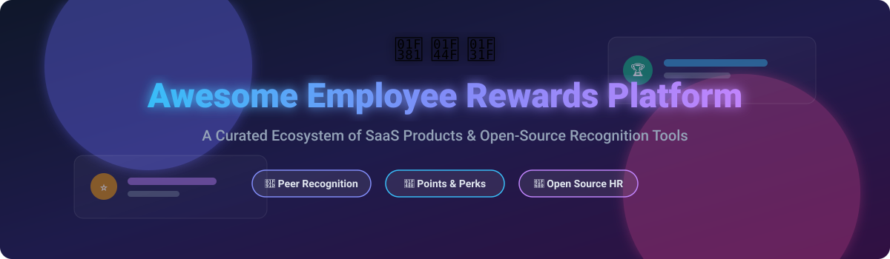

  

# 🌟 Awesome Employee Rewards Platform 🎁

  
  
  
  
  

---

## 🚀 Overview & Market Analysis 📊

The global **Employee Recognition & Rewards Software Market** is estimated at **$12.5 Billion - $14.2 Billion** and is projected to reach **$24 Billion+ by 2030** (growing at ~10.5% CAGR). 

The industry is **moderately fragmented**: 
- **Enterprise Tier**: Dominated by large suites like **Workhuman** and **Achievers** serving Fortune 500 enterprises with custom global catalogs.
- **Mid-Market & Growth Tier**: Fast-growing platforms like **Awardco** (unicorn status with $1B+ valuation), **Bonusly**, **Nectar**, **Guusto**, and **Kudos** capture mid-market adoption with easy Slack/Teams integrations and point systems.
- **Open-Source & Web3 Tier**: Modern open-source solutions like **Meeds** and **Coordinape** cater to DAOs and privacy-first engineering teams seeking flexible internal tools.

This repository tracks top **SaaS platforms** and **open-source GitHub projects** for **Employee Rewards**, **Peer-to-Peer Recognition**, **Point Incentive Systems**, and **Culture Building**.

---

## 📋 Table of Contents

- [🏢 SaaS & Hosted Platforms](#-saas--hosted-platforms)
- [🔓 Open-Source GitHub Projects](#-open-source-github-projects)
- [🤝 How to Contribute](#-how-to-contribute)
- [💖 Support](#-support)
- [📈 Star History](#-star-history)
- [⚠️ Disclaimer](#%EF%B8%8F-disclaimer)

---

## 🏢 SaaS & Hosted Platforms

> [!NOTE]
> Platforms are sorted by estimated enterprise size, annual revenue, and market valuation in descending order.

| Platform | Key Focus & Strengths | Pricing Starting Tier | Free Tier / Trial Limit | Revenue / Valuation (Est.) |
| :--- | :--- | :--- | :--- | :--- |
| **[Workhuman](https://www.workhuman.com/)** 🏆 | Enterprise social recognition, Human Intelligence, performance management & turnover reduction. | **$4.00/user/month** (Enterprise custom billing) | **14-Day Free Demo** (No permanent free plan) | **Revenue:** ~$1.2 Billion  **Valuation:** ~$2.1 Billion |
| **[Awardco](https://www.awardco.com/)** 🦄 | All-in-one recognition & global reward catalog powered by native Amazon Business integration. | **$3,000/year base package** (~$3–$5/user/month) | **14-Day Product Demo** (No free forever plan) | **Revenue:** $75.2 Million (2024)  **Valuation:** $1.0+ Billion (Series B) |
| **[Achievers](https://www.achievers.com/)** 🏢 | Enterprise employee appreciation, social recognition feed, and global rewards marketplace. | **$4.00/user/month** (Custom enterprise quote) | **14-Day Custom Demo** (No self-serve free plan) | **Revenue:** ~$65 Million  **Funding:** $49.4 Million raised |
| **[Reward Gateway](https://www.rewardgateway.com/)** 🛍️ | Employee engagement, customized discounts, financial wellness, and peer recognition. | **$6.00/user/month** (£5–£8 PEPM starting tier) | **14-Day Free Demo** (No free version) | **Revenue:** ~$80 Million  (Acquired by Abry / Edenred) |
| **[Bonusly](https://bonusly.com/)** ⚡ | Fun, frequent peer-to-peer micro-bonuses tied to core company values with instant reward redemptions. | **$3.00/user/month** (Appreciation plan, annual) | **Free Forever Plan** (Up to 8 users) & 30-Day Trial | **Revenue:** $12.9 Million ARR  **Valuation:** ~$76 Million |
| **[Nectar](https://nectarhr.com/)** 🍯 | Peer recognition, milestone rewards automation, company swag store, and wellness challenges. | **$2.75/user/month** ($4,000 annual min for mid-market) | **14-Day Guided Demo** (No free trial) | **Revenue:** ~$8.0 Million ARR  **Funding:** $53.5 Million raised |
| **[Kudos](https://kudos.com/)** 👏 | Culture-first corporate appreciation, analytics, employee morale tracking, and performance feedback. | **$3.25/user/month** (Plus tier starting price) | **14-Day Guided Demo** (No free trial) | **Revenue:** ~$15 Million  **Funding:** $10 Million raised |
| **[Guusto](https://guusto.com/)** 🎁 | Flexible gift card delivery, single or bulk recognition with no wasted budget on unused rewards. | **$125.00/month** (Lite team plan, unlimited claimers) | **Free Single-Gift Plan** (Pay per gift, no monthly fee) | **Revenue:** ~$5.0 Million ARR  Bootstrapped & profitable |
| **[Assembly](https://joinassembly.com/)** 🧩 | All-in-one intranet, peer recognition, employee rewards, and engagement workflow automations. | **$2.80/user/month** (Billed annually) | **Free Starter Plan** (Up to 10 users forever) | **Revenue:** ~$4.0 Million ARR  Growth stage startup |
| **[Mo](https://www.mo.com/)** 🎉 | Building habits of appreciation through automated prompts, weekly highlights, and team nominations. | **$3.00/user/month** (Starter tier) | **30-Day Free Trial** (Full access) | **Revenue:** ~$3.0 Million ARR  Growth stage company |

---

## 🔓 Open-Source GitHub Projects

> [!TIP]
> Open-source repos are sorted by GitHub Stars_Counts in descending order.

| Project | Stars_Badge | Description & Tech Stack | License |
| :--- | :--- | :--- | :--- |
| **[Coordinape](https://github.com/coordinape/coordinape-protocol)** 🌐 |  | Web3 decentralized peer allocation platform for gift circles, token distributions, and on-chain reputation rewards.  **Tech Stack**: Solidity, TypeScript, React. | MIT |
| **[Meeds](https://github.com/meeds-io/meeds)** 🎮 |  | Open-source gamified employee engagement platform. Built-in kudos, task-based contribution points, spaces, and reward distribution.  **Tech Stack**: Java, Vue.js, Docker. | LGPL-3.0 |
| **[Good Job](https://github.com/dongitran/Good-Job)** 🏅 |  | Production-grade multi-tenant recognition platform featuring **dual-balance points** (giveable monthly budget + redeemable earned wallet), reward catalog with stock tracking, and real-time SSE feed.  **Tech Stack**: React 18, NestJS 11, PostgreSQL, Redis, Docker. | MIT |
| **[Nexus Intranet](https://github.com/praveen-sripati/nexus)** ⚡ |  | Modern React intranet dashboard starter kit featuring an integrated peer-to-peer **Kudos Recognition System**, team events, and announcements feed.  **Tech Stack**: React, TypeScript, Tailwind CSS, Shadcn/UI. | MIT |
| **[Employee Recognition Bot](https://github.com/n1ght-m4re/slack-recognition-bot)** 🤖 |  | Open-source Slack bot for sending direct peer appreciation, user mentions, and tracking appreciation history in Slack channels.  **Tech Stack**: Next.js, Node.js, Slack Bolt SDK. | MIT |
| **[Dekka Reward Management](https://github.com/Sanskar-Technolab-Pvt-Ltd/dekka_reward_management)** ⚙️ |  | Reward management app for tracking achievements, performance perks, and automated incentive programs.  **Tech Stack**: Python, Frappe Framework, React. | GPL-3.0 |
| **[Employee Rewards System](https://github.com/Ayesha24banu/Employee-Rewards-and-Reconigtion-system)** 🎓 |  | Web-based peer recognition software with points allocation, monthly leaderboards, and basic catalog redemptions.  **Tech Stack**: Python Flask, MySQL, HTML/JS. | CC BY-NC 4.0 |

---

## 🤝 How to Contribute

Contributions are welcome! Please follow these steps to add new SaaS or open-source tools:

1. 🍴 **Fork** the repository.
2. 📝 **Add/edit** entries in `README.md` maintaining standard tabular formatting and factual data.
3. 🔗 Check that all external links, pricing tiers, and open-source Stars_Badges link properly.
4. 🚀 **Submit a Pull Request** with a detailed explanation of your changes.

Check out [Awesome-Awesome-Awesome](https://github.com/ishandutta2007/Awesome-Awesome-Awesome) for more curated awesome lists!

---

## 💖 Support

If you find this repository helpful, please consider showing your support:

- ⭐ **Star** this repository on GitHub!
- 🔀 **Fork** and contribute your favorite employee experience tools.
- 📢 **Share** with HR leaders, People Ops, and Culture Engineers.
- ☕ **Sponsor / Buy me a coffee**: Support ongoing open-source development at [GitHub Sponsor Dashboard](https://github.com/sponsors/ishandutta2007).

Thank you for helping make employee appreciation open, transparent, and rewarding for every team! ❤️

---

## 📈 Star History

---

## ⚠️ Disclaimer

- This list is **community-curated** for research purposes and does not constitute endorsement.
- SaaS prices, free tier terms, and corporate valuations change frequently; consult vendors directly for active contracts.
- **Open-Source Notice**: While open-source tools like **Good Job** and **Meeds** offer powerful codebases, commercial platforms provide automated fulfillment (e.g., Amazon gift cards, physical swag delivery) and enterprise HRIS syncing.

---

Made with ❤️ for People Operations, HR Leaders, and Culture Builders globally.

